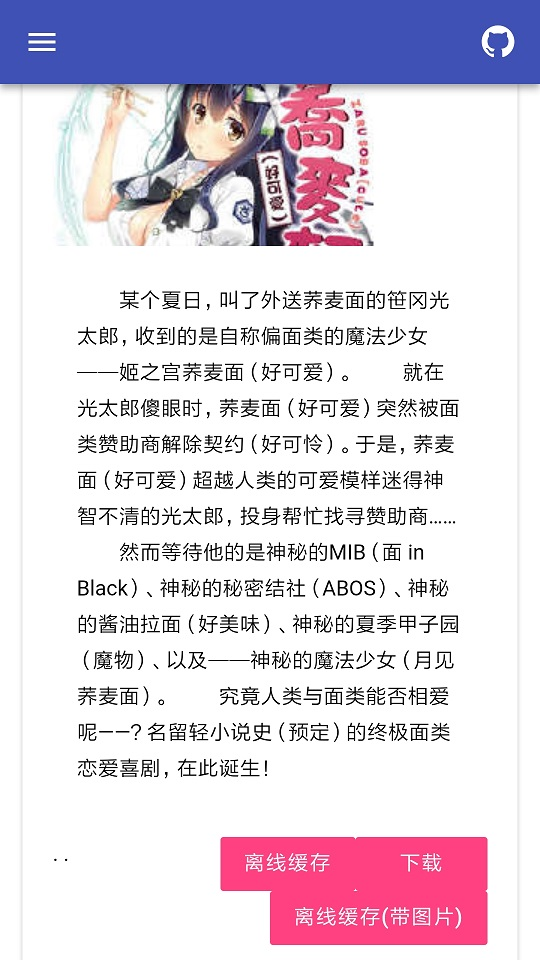
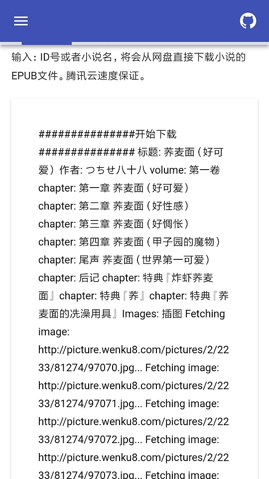
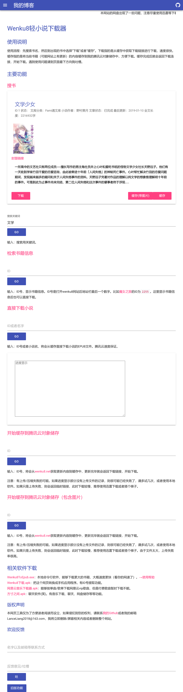

### 使用的模块的说明

```
把www.wenku8.net的轻小说在线转换成epub格式。wenku8.net没有版权的小说则下载TXT文件然后转换为epub文件。

wk2epub [-h] [-t] [-m] [-b] [list]

    list            一个数字列表，中间用空格隔开

    -t              只获取文字，忽略图片。
                    但是图像远程连接仍然保留在文中。
                    此开关默认关闭，即默认获取图片。

    -m              多线程模式。
                    该开关已默认打开。

    -i              显示该书信息。

    -b              把生成的epub文件直接从stdio返回。
                    此时list长度应为1。
                    调试用。

    -h              显示本帮助。

调用示例:
    wk2epub -t 1 1213

关于:
    https://github.com/LanceLiang2018/Wenku8ToEpub

版本:
    2020/3/8 1:45 AM
```

### 文件下载方式

#### 方式1

[书名形式](https://light-novel-1254016670.cos.ap-guangzhou.myqcloud.com/小说标题.epub)

https://light-novel-1254016670.cos.ap-guangzhou.myqcloud.com/{{小说标题}}.epub

小说标题以显示在wenku8网站上的为准，例如

    TIGER×DRAGON！(龙与虎)

示例:

[文学少女](https://light-novel-1254016670.cos.ap-guangzhou.myqcloud.com/文学少女.epub)

#### 方式2

~~[ID形式](https://light-novel-1254016670.cos.ap-guangzhou.myqcloud.com/小说ID.html)~~(废弃。)

    注意等待静态HTML跳转

## 更新：服务器版

- 从缓存中获取。存在此书则直接重定向到下载链接。

    https://wenku8.herokuapp.com/get/书本id

- 更新CDN缓存。更新完成后就会重定向到下载链接，请耐心等候。小书5s，大书30s以上。(Heroku在30s没有响应时会报错。)

    https://wenku8.herokuapp.com/cache/书本id
 
- 直接获取下载。获取最新的章节，但是不更新CDN。这个链接可以获取图片。好吧这个速度够慢的...

    https://wenku8.herokuapp.com/no_cache/书本id

## 更新：美化UI和功能

[主站](http://wenku8.herokuapp.com)：http://wenku8.herokuapp.com

免费托管于heroku。可以https，但是会造成iframe引用源站的图片没法显示。

在这里提出issues或者在网站内反馈。

**TODO**:

- [x] MDUI配置
- [x] 书籍信息显示
- [x] 下载过程实时反馈

**效果展示**





